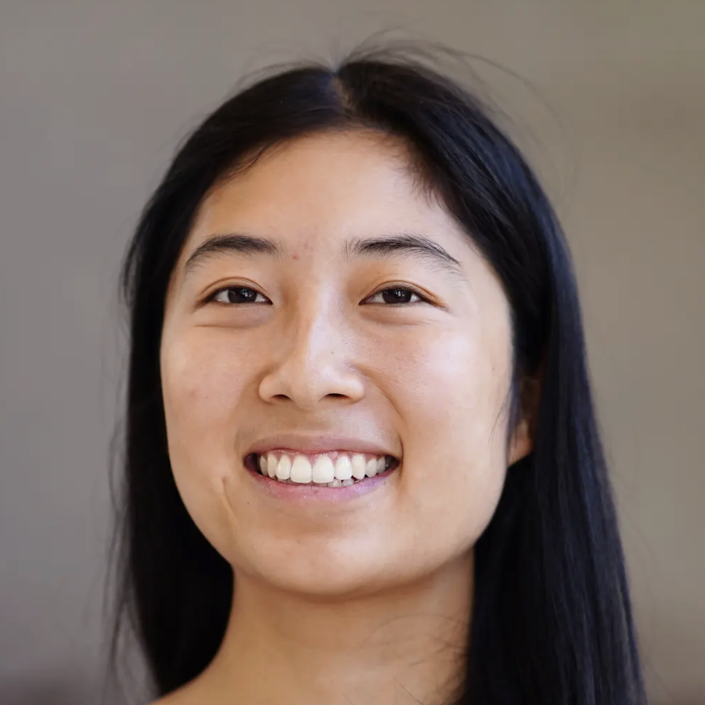

### Details

* The address: [1135 Tremont St, Boston, MA 02120](https://maps.app.goo.gl/LtiWjzXrJMuCUJ8A7) (Renaissance Park)
* The room: Room 909
* The time: 9:00 AM - 5:00 PM

Some lunch options to save you time!

* Sufra Mediterranean Food, [52 Queensberry St, Boston, MA 02215](https://maps.app.goo.gl/dP6GjaipvfWxdcgo6) (19min walk)
* Joe's Famous Subs & Pizza, [140 Dudley St, Roxbury, MA 02119](https://maps.app.goo.gl/3BbwSfX83T9Jtdor7) (16min walk)
* Boston Shawarma, [315 Huntington Ave, Boston, MA 02115](https://maps.app.goo.gl/KFfxWUaEzrSpxMCm8) (12min walk)
* Mamacita Mexican Comida, [329 Huntington Ave, Boston, MA 02115](https://maps.app.goo.gl/WJgr2kvqRn3DVhm7A) (11min walk)
* Milkweed, [1508 Tremont St, Boston, MA 02120](https://maps.app.goo.gl/UuNJTGoKT3agiUtf6) (16min walk)
* Omi Korean Grill, [267 Huntington Ave, Boston, MA 02115](https://maps.app.goo.gl/4RJA7CkFPaSVNd1H8) (15min walk)
* Silver Slipper Restaurant, [2387 Washington St, Roxbury, MA 02119](https://maps.app.goo.gl/RuEYiAryP3a7cdoK6) (14min walk)
* Fasika Cafe, [51 Roxbury St, Boston, MA 02119](https://maps.app.goo.gl/wV9sQE2jZomUszRq8) (14min walk)

### Confirmed Speakers

::: {layout-ncol=2 layout-nrow=2}

::: {style="float: left; margin-right: 15px;"}

{width="150px" style="border-radius: 50%;"}

##### [Allison Wan](https://www.networkscienceinstitute.org/people/allison-wan) Northeastern University

:::

::: {style="float: left; margin-right: 15px;"}

{width="150px" style="border-radius: 50%"}

##### [Yanna Kraakman](https://personen.utwente.nl/y.j.kraakman) University of Twente

:::

::: {style="float: left; margin-right: 15px;"}

{width="150px" style="border-radius: 50%"}

##### [Alec Kirkley](https://aleckirkley.com/) University of Hong Kong

:::

::: {style="float: left; margin-right: 15px;"}

{width="150px" style="border-radius: 50%"}

##### [Tim LaRock](https://tlarock.github.io/) Princeton University

:::

:::

### Tentative Schedule

| Time            | Activity                                    |
|-----------------|---------------------------------------------|
| 09:00 – 09:10   | Introduction to the hackathon               |
| 09:10 – 09:20   | Introduction to A Blue Start: Alyssa Smith  |
| 09:20 – 09:30   | Lightning Talk 1: Alec Kirkley              |
| 09:30 – 09:40   | Lightning Talk 2: Allison Wan               |
| 09:40 – 09:50   | Lightning Talk 3: Tim LaRock                |
| 09:50 – 10:00   | Lightning Talk 4: Yanna Kraakman            |
| 10:00 – 10:15   | *Coffee Break*                              |
| 10:15 – 12:30   | **Working Session 1**                       |
| 12:30 – 14:00   | **Lunch Break**                             |
| 14:00 – 16:00   | **Working Session 2**                       |
| 16:00 – 16:15   | *Coffee Break*                              |
| 16:15 – 17:00   | Wrap-Up: Progress made                      |
